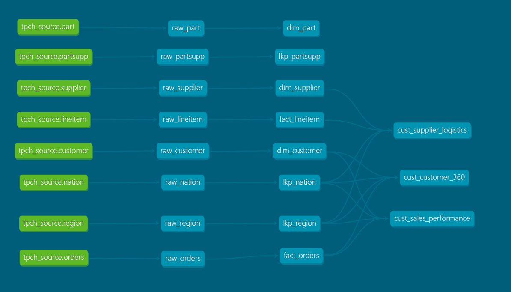

# Propelling Tech Project

## 1. Introducción y Contexto
El objetivo de este repositorio es diseñar e implementar una arquitectura **Medallion** completa utilizando el dataset estándar **TPC-H SF1** disponible en Snowflake (`SNOWFLAKE_SAMPLE_DATA.TPCH_SF1`). 

El proyecto implementa un flujo completo de ingeniería de datos usando **dbt Core** y **Snowflake**, estructurado en tres capas de datos bien definidas (**Bronze**, **Silver** y **Gold**) para transformar datos crudos en productos de datos analíticos listos para el cosumo de negocio.

---

## 2. Arquitectura de Datos y Criterios de Capas

### Capa Bronze
* **Propósito:** Aterrizar los datos desde origen tal como vienen, preservando su estructura original y añadiendo una columna de trazabilidad (`RAW_LOADED_AT`).
* **Implementación:** Carga incremental mediante estrategia `merge` en dbt, utilizando el identificador máximo de la tabla para capturar únicamente los nuevos registros.
* **Ejemplo (`raw_lineitem`):**
```sql
{{
    config(
        materialized='incremental',
        unique_key=['l_orderkey', 'l_linenumber'],
        incremental_strategy='merge'
    )
}}

SELECT 
    l_orderkey, l_partkey, l_suppkey, l_linenumber, l_quantity,
    l_extendedprice, l_discount, l_tax, l_returnflag, l_linestatus,
    l_shipdate, l_commitdate, l_receiptdate, l_shipinstruct,
    l_shipmode, l_comment,
    CURRENT_TIMESTAMP() AS RAW_LOADED_AT
FROM {{ source('tpch_source', 'lineitem') }}


    WHERE l_orderkey >= (SELECT COALESCE(MAX(l_orderkey), 0) FROM {{ this }})

```
### Capa Silver
* **Propósito:** Aplicar reglas de negocio, estandarizar formatos (mayúsculas, limpieza de espacios con `TRIM`, conversión de fechas), calcular métricas y estructurar los datos en tablas de dimensiones (`DIM_`), hechos (`FACT_`) y tablas de consulta (`LKP_`).
* **Estrategia Incremental:** Implementación de cargas incrementales mediante estrategia `merge` en dbt, utilizando el identificador máximo o clave primaria (`WHERE ID_ > (SELECT COALESCE(MAX(ID_), 0) FROM {{ this }})`) para capturar y actualizar únicamente los registros nuevos de forma eficiente.

### Capa Gold
* **Propósito:** Ofrecer vistas optimizadas y listas para consumo analítico o herramientas de BI (`materialized='view'`).
* **Vistas creadas:**
  1. `CUST_SALES_PERFORMANCE`: Análisis de ventas netas, volumen de pedidos y valores medios agrupados por año, mes, región, nación y segmento de mercado.
  2. `CUST_SUPPLIER_LOGISTICS`: Seguimiento de la cadena de suministro, control de entregas retrasadas (`IS_DELAYED_DELIVERY`) y importes por proveedor.
  3. `CUST_CUSTOMER_360`: Vista integral del cliente (*Customer 360*), calculando el valor del ciclo de vida (`LIFETIME_VALUE`), total de pedidos y estado VIP basado en balances y umbrales de negocio.

---

## 3. Estructura del Proyecto

```text
/propelling_tech_project
  ├─ analyses/
  ├─ logs/
  ├─ macros/
  │   ├─ .gitkeep
  │   └─ get_custom_schema.sql           # Macro personalizada para control de esquemas
  ├─ models/
  │   ├─ 01_gold/
  │   │   ├─ cust_customer_360.sql
  │   │   ├─ cust_sales_performance.sql
  │   │   ├─ cust_supplier_logistics.sql
  │   │   └─ schema.yml
  │   ├─ 02_silver/
  │   │   ├─ dim_customer.sql
  │   │   ├─ dim_part.sql
  │   │   ├─ dim_supplier.sql
  │   │   ├─ fact_lineitem.sql
  │   │   ├─ fact_orders.sql
  │   │   ├─ lkp_nation.sql
  │   │   ├─ lkp_partsupp.sql
  │   │   ├─ lkp_region.sql
  │   │   └─ schema.yml
  │   └─ 03_bronze/
  │       ├─ raw_customer.sql
  │       ├─ raw_lineitem.sql
  │       ├─ raw_nation.sql
  │       ├─ raw_orders.sql
  │       ├─ raw_part.sql
  │       ├─ raw_partsupp.sql
  │       ├─ raw_region.sql
  │       ├─ raw_supplier.sql
  │       ├─ schema.yml
  │       └─ sources.yml
  ├─ seeds/
  ├─ snapshots/
  ├─ target/
  ├─ tests/
  ├─ .gitignore
  ├─ .user.yml
  ├─ dbt_project.yml           # Configuración general
  ├─ initial_setup.sql         # Script creación setup inicial
  ├─ profiles.yml              # Conexión a base de datos
  └─ README.md
```

---

### 4. Ejecución del proyecto
Una vez configurado el entorno y el perfil, se puede compilar y ejecutar los modelos de forma secuencial:

* **Probar la conexión:**
  ```bash
  dbt debug
  ```
* **Ejecutar todo el flujo de datos (Bronze -> Silver -> Gold):**
  ```bash
  dbt run
  ```

---

### 5. Documentación y Linaje de Datos (DAG)
El proyecto incluye documentación interactiva generada automáticamente por dbt. Para explorarla localmente junto con el linaje de dependencias (DAG), ejecutar:

```bash
dbt docs generate
dbt docs serve
```

Esto abrirá de forma local una interfaz web en tu navegador (disponible por defecto en http://localhost:8080/#!/overview) donde podrás consultar las descripciones de las tablas, columnas, pruebas y el flujo completo de transformación de toda la arquitectura Medallion.

**Visualización del Linaje de Datos:**


## 6. Orquestración y Despliegue en dbt Cloud
Para automatizar la ejecución de los modelos de forma periódica, se ha configurado un entorno de despliegue en **dbt Cloud** conectado al repositorio.

* **Job Configurado:** `propelling_tech_scheduler`
* **Frecuencia:** Programado para ejecutarse automáticamente **todos los días cada 12 horas**.
* **Propósito:** Garantizar que las capas Bronze, Silver y Gold se mantengan actualizadas de manera continua con los últimos cambios procedentes del origen sin intervención manual.